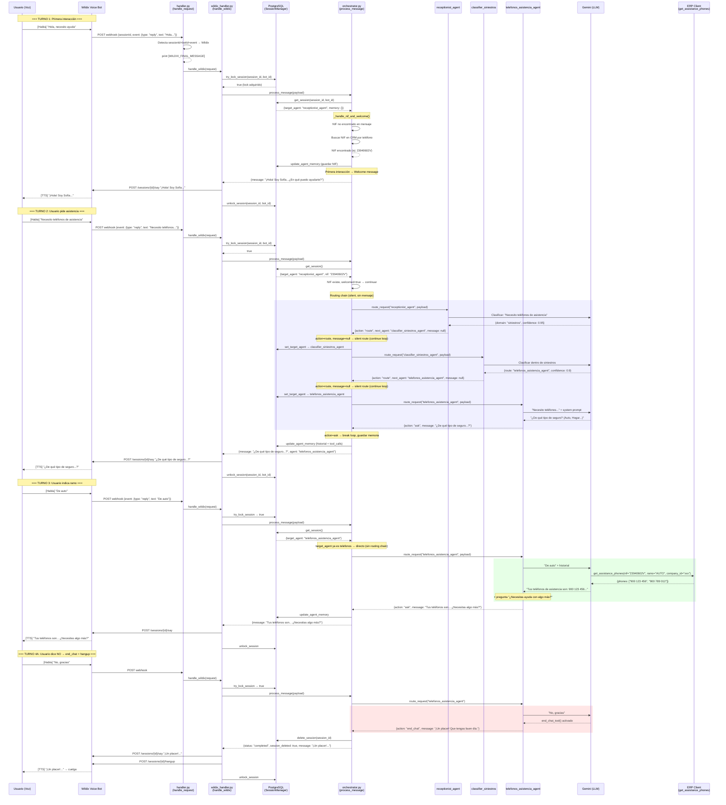
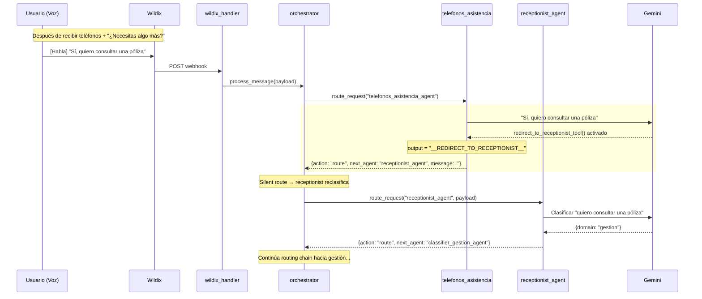
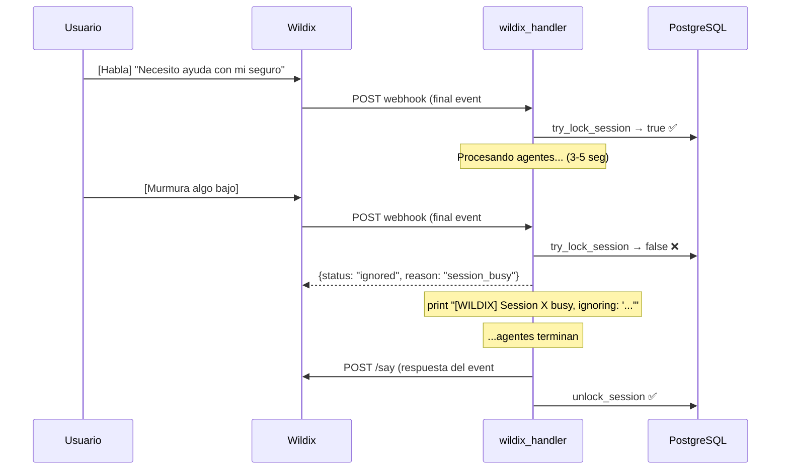

# Diagrama de Secuencia: Llamada Wildix → Teléfonos de Asistencia

## Flujo completo (caso éxito: teléfonos encontrados)

## Flujo alternativo 4B: Usuario quiere seguir → redirect

## Protección contra mensajes concurrentes (session lock)

